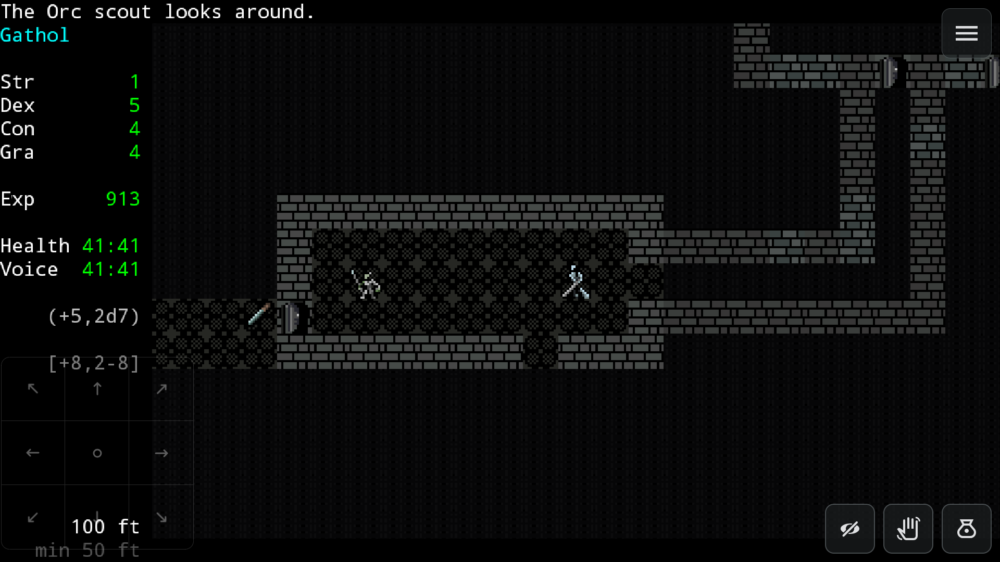

# Sil-Q Android

Sil-Q Android is an unofficial Android port of [Sil-Q](https://github.com/sil-quirk/sil-q), a traditional roguelike focused on exploration, stealth, and tactical combat.

## Downloads

Download the latest [release](https://github.com/pineyellow/Sil-Q-Android/releases/latest).

## Building

See [BUILD.md](BUILD.md) for requirements and build instructions.

## License

The source retains the original copyright and license notices. See [LICENSE.md](LICENSE.md) for the original game's licensing terms and
exceptions. Third-party components retain their own licenses.

When distributing an APK or another binary build, make the corresponding
source for that exact build available under the applicable licenses.
